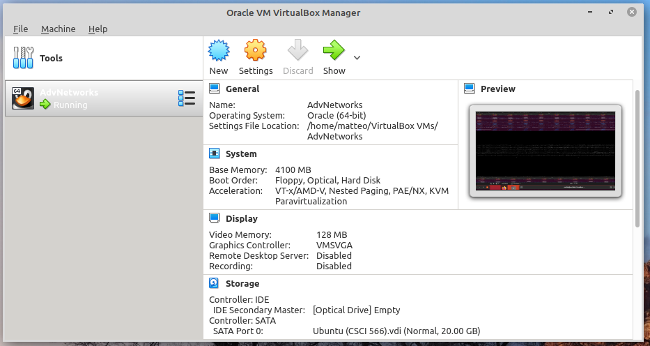
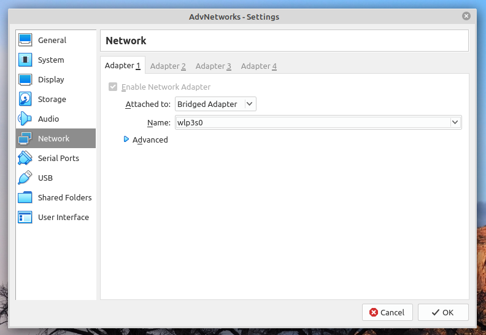
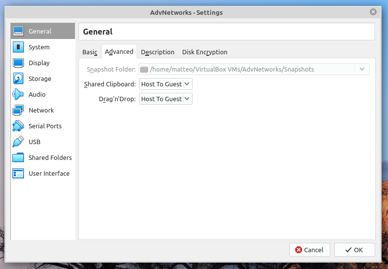

# csci566-SQS-demo

Let's check out Amazon Simple Queue Service using Python. 
 
* General intro via Amazon docs

    * https://docs.aws.amazon.com/AWSSimpleQueueService/latest/SQSDeveloperGuide/welcome.html

* The Python SDK documentation for SQS

    * https://boto3.amazonaws.com/v1/documentation/api/latest/reference/services/sqs.html

* The python example code provided by Amazon:

    * https://github.com/awsdocs/aws-doc-sdk-examples/tree/master/python/example_code/sqs
    * The test suite has some dependencies in the higher level directories, which have been copied to `test/test_tools`.


## If you haven't already, connect your VirtualBox to the internet. 


Get your wireless interface
```bash
ifconfig
```

Connect your virtualbox to your wireless interface. Click the settings cog on your virtualbox manager.



Enable your Network Adapter 1 and attach it to the `Bridged Adapter`. Select the name which corresponds to the network interface you want to use from your local machine, such as your wireless interface you discovered using `ifconfig`.



Bonus, if you want to enable copy-paste and haven't already, do that in the General > Advanced tab. 



# Set up SQS demo repo

```bash
git clone https://github.com/matteobjornsson/csci566-sqs-demo
```
## Configure AWS Credentials

### If you have an education account, do the following:

1. Log into your Vocareum account at https://labs.vocareum.com/
1. Click on the `Account Details` Button.
1. Click on the `Show` Button next to `AWS CLI:`
1. Copy all of the text you see there into `~/.aws/credentials` in your VirtualBox.

### If you have a non-educational account, do the following:

1. Log into your account at https://console.aws.amazon.com/
1. Click on your name top right corner and then `My Security Credentials`.
1. Click `Create New Access Key` and follow instructions. 
1. Create the `~/.aws/credentials` file in your VirtualBox as indicated below but substitute in your real access key and secret key. 

Do the following in your VirtualBox:
```bash
cd ~
mkdir .aws
vim .aws/credentials
```
Copy paste your credentials such that the `~/.aws/credentials` file looks like the text below:
```
[default]
aws_access_key_id = YOUR_ACCESS_KEY
aws_secret_access_key = YOUR_SECRET_KEY
```
Additionally, you will want to configure your region:

```bash
vim ~/.aws/config
```
Which should look like this: 
```
[default]
region = us-east-1
```
## Install Python Dependencies
```bash
pip install boto3 pytest
```
# Test Out That The Existing Code Works

This should test the basic AWS SQS functionality. 

```bash
cd ~/Desktop/csci566-sqs-demo/sqs_example_code
python -m pytest -o log_cli=1 --log-cli-level=INFO test/test_message_wrapper.py
```


