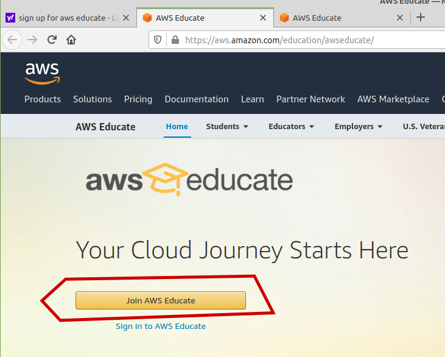
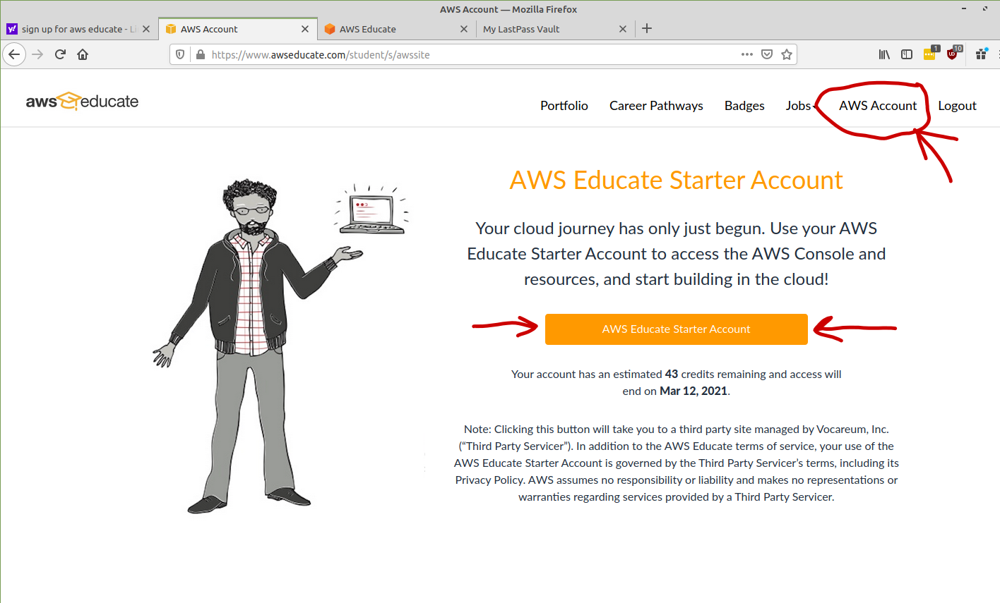
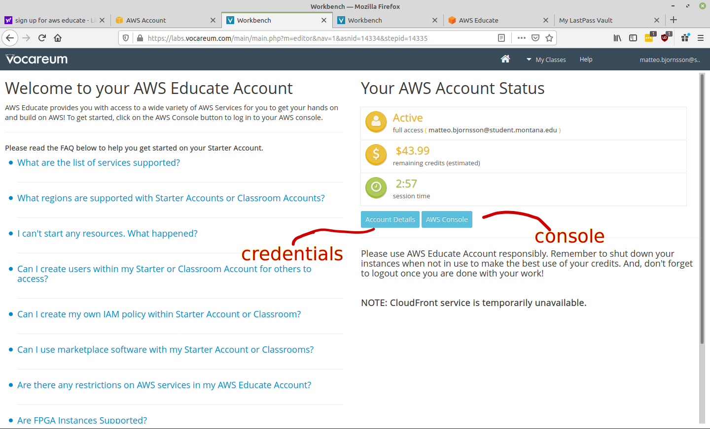

## Setting up an AWS Educate account

If you do not already have an AWS educate account, you can follow these instructions to create one. You get free credits and a year or so to putter around with AWS. Take note: this is not a full fledged account. If, after you've gotten used to it, and you're trying new things such as creating new IAM profiles, you will hit roadblocks because this account is limited. To have a full fledged AWS account you need to create one through the normal aws home page.
start here:

https://aws.amazon.com/education/awseducate/

click "Join AWS Educate"
note: USE YOUR SCHOOL EMAIL `first.last@student.montana.edu`

Once you follow all the instructions and create an account, then sign in to your account here:

https://www.awseducate.com/signin/SiteLogin

Click the AWS Account tab, then click the AWS Educate Starter Account button.

This will bring you to your educate account. This page is not AWS. This page is your gateway hosted via Vocareum Labs to your educate account and tells you the limitations as well as your remaining credits. This is the page you have to go to to access your account details, these are found in the Account Details button

The credentials which live in the `Account Details` button are what you need to store on your local machine in order to access AWS resources using any language SDK, such as the python SDK Boto3. 

if you want to shortcut this whole process next time, bookmark this link, it will take you right to the Vocareum educate gateway

https://labs.vocareum.com/

Click on the `AWS Console` Button to be brought to your AWS Console where all the magic happens. 